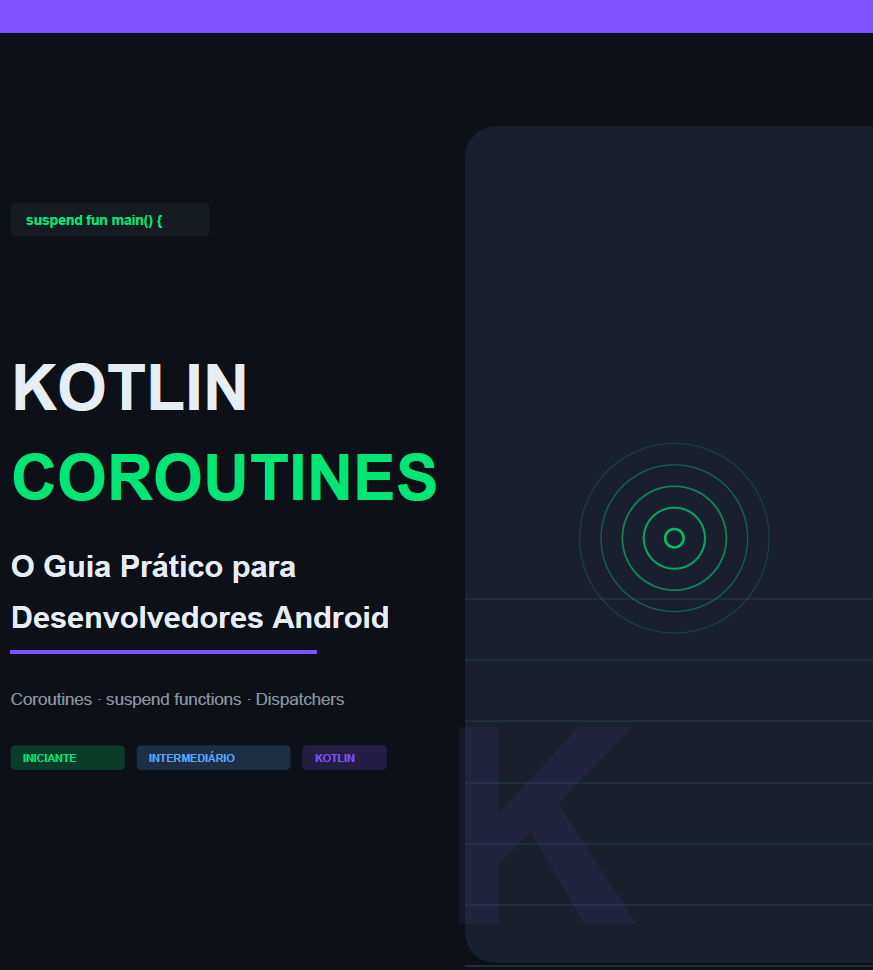

    

-------

# Projeto EBOOK Gerado por I.A.s

 > ℹ️ **NOTE:** Este é o repositório desenvolvido durante o curso [Formação ChatGPT for Devs](https://web.dio.me/track/formacao-chatgpt-devs) na plataforma da [DIO](https://dio.me).

Projeto com o objetivo de gerar um ebook digital com as facilidades das ferramentas de IA. todos os prompts
seguem abaixo.

<a href="https://github.com/rsl/prompts-recipe-to-create-a-ebook/blob/main/output/kotlin-coroutines-guia-pratico.pdf" title="View PDF now"> 📕Clique aqui para ler</a>

## 💻 Tecnologias utilizadas no projeto

- [Claude](https://claude.ai/) - para título e conteúdo

## 🧠 Prompts

Claude：

|   Ação   | prompt                                                                                                                                                                                                                                                                         |
| :------: | ------------------------------------------------------------------------------------------------------------------------------------------------------------------------------------------------------------------------------------------------------------------------------ |
| conteúdo | Preciso criar um ebook em português baseado neste exemplo "https://github.com/felipeAguiarCode/prompts-recipe-to-create-a-ebook/blob/main/output/ebook%20-%20css%20jedi%20output.pdf". O tema do nosso ebook será Desenvolvimento Android - Uso de Coroutines, suspend functions e dispatchers. Leia o arquivo do link para entender a estrutura e formato. Gere o conteúdo para a nossa versão do ebook com nosso tema, pense na diagramação e imagens necessárias, incluindo capa, diagramas e ilustrações, pense em exemplos de código para demonstrar os conceitos. O ebook deve ser direto, mas deve er escrito de modo a programadores iniciantes e intermediários consigam entender, não deve ter muitas páginas, não é um TCC. É um ebook mais no estilo cheat sheet, passando a informação necessária para uso. |

## ✨ Features

- Conteúdo gerado via Claude

## 📚 Materiais

- Imagens utilizadas em `assets`
- ebook gerado durante as aulas em `output`

## 📖 Conteúdo do Ebook

| # | Capítulo |
|:-:| -------- |
| 01 | O Problema: Por que Coroutines? |
| 02 | Conceitos Fundamentais |
| 03 | `suspend fun` — A Magia Acontece Aqui |
| 04 | CoroutineScope e Builders |
| 05 | Dispatchers — Onde o Código Roda |
| 06 | Job, Cancelamento e Ciclo de Vida |
| 07 | `async` / `await` — Paralelismo Real |
| 08 | Coroutines no Android: ViewModel & Lifecycle |
| 09 | Tratamento de Erros |
| 10 | Cheat Sheet Rápido |

## 🛠️ Instruções de execução

Utilize os prompts acima nas ferramentas sugeridas para gerar o material base e utilize uma ferramenta de edição de documentos como power point, libreoffice , indesign para diagramação.

## 👨‍💻 Expert

    
    
&nbsp&nbsp&nbspRobson Lima 
    &nbsp&nbsp&nbsp
    <a href="https://github.com/rsl50">
    GitHub</a>&nbsp;|&nbsp;
    <a href="https://www.linkedin.com/in/robsonslima">LinkedIn</a>

  

---

⌨️ com 💜 por [Robson Lima](https://github.com/rsl50)
